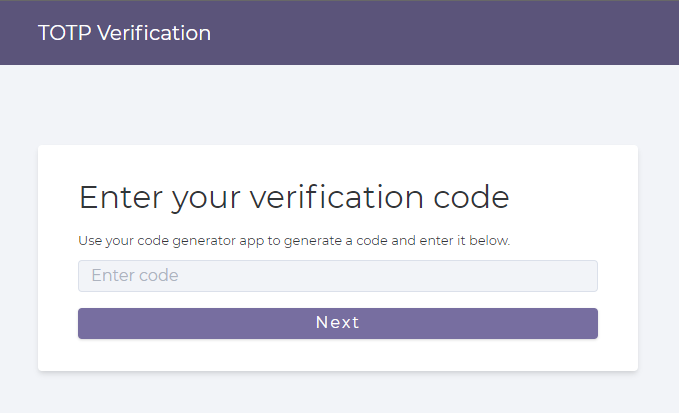
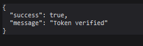
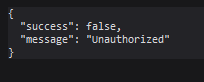
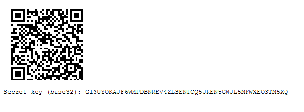

# twoFA
Two-factor Authentication

This project implements Time-based OTP (TOTP) verification. You can generate a secret key which you can connect to a TOTP generation app such as Google Authenticator. The TOTP token generated by the app can then be entered for verification.

## Getting Started
### Prerequisites
* [Node.js](https://nodejs.org/en/)
* [TypeScript](https://www.typescriptlang.org/download)
* [ts-node](https://www.npmjs.com/package/ts-node)

### Installation
(Type these commands by opening the command prompt (for windows) in the root directory of this repository)\
Install project packages
```
npm install
```
### Build
To build the project (generate js files) and launch a localhost by running the js files
```
npm run build
npm start
```
OR you can run the code without generating js files (runs nodemon for `src/app.ts`)
```
npm run dev
```
You can then open your browser, and run the localhost on port 5000
```localhost:5000```

## Output
* Run the code and go to localhost on port 5000 (`localhost:5000`) in your browser, you will see a basic HTML form where you can enter the TOTP token (code). Click on the Next button (or press Enter) to check for verification.

* To generate your secret key, go to the url `localhost:5000/totp/generate`. You should see a QR code along with a secret key (base32 encoded). Scan the QR code with TOTP generation app or type out the key to set up. Then replace the existing secret key in `src/app.ts` (in `secretKey` variable) and build.

### Screenshots

TOTP Verification form\


Authorized\


Unauthorized\


Generated secret key\

